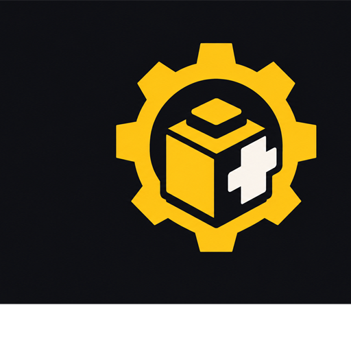
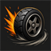

<p align="center">
  
</p>

# Crash & Drift



Small Ore Factory Squad mod built with OFS SDK.

- When the locally driven vehicle hits an AI traffic car, that traffic car
  plays a visual-only explosion and is recycled through Gley's traffic API.
  Player-owned SCC vehicles, forklifts and Yale vehicles are never targets.
- Holding either Shift key while driving lowers the active vehicle's sideways
  grip. Releasing Shift restores the exact original drivetrain values.
- The explosion uses short-lived SDK-generated meshes and unlit materials. It
  does not invoke dynamite, terrain excavation, damage or explosion forces.

Version `0.1.3` intentionally declares `multiplayer: incompatible`. Recycling
vanilla vehicles is server-authoritative in a single-player host, but the mod
does not yet ship the validation/authorization needed for remote peers.

Build the mod from the repository root:

```powershell
./eng/build.ps1
./eng/package.ps1 -ManagerPath C:/path/to/ofs-manager.exe
```

The visual effect is generated at runtime, so a clean checkout produces the
playable package without opening Unity. The previous prefab experiment remains
under `authoring/` only as historical source and is not shipped.
